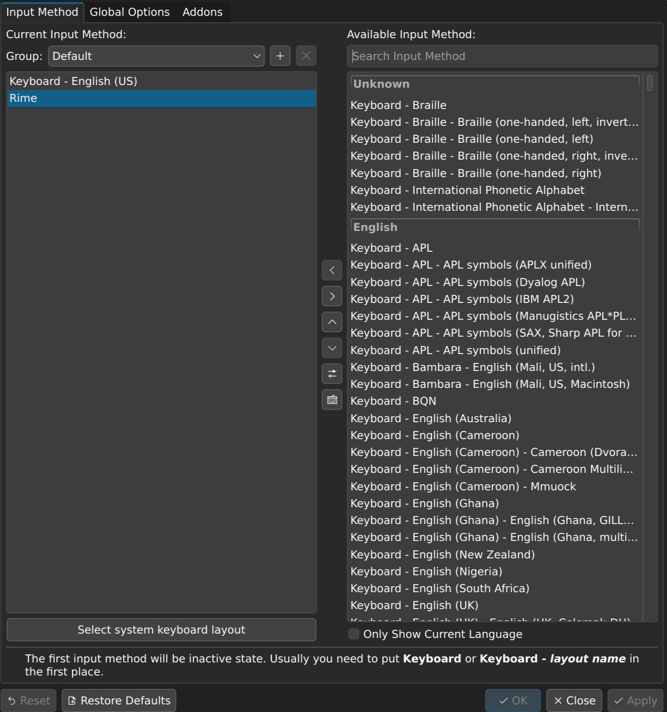

# 我的Fcitx5-rime配置：雾凇拼音+万象语法大模型

[](https://www.gnu.org/licenses/gpl-3.0.txt)


功能齐全，词库体验良好，语法大模型智能度高。

## 安装步骤

### 1. 安装依赖软件

使用 pacman 安装 fcitx5 和 rime：

```bash
sudo pacman -S fcitx5-im fcitx5-rime --needed
```

### 2. 配置环境变量

编辑 `/etc/environment` 文件，添加以下环境变量：

```bash
sudo nano /etc/environment
```

在文件末尾添加：

```
# Fcitx5
XIM="fcitx"
GTK_IM_MODULE=fcitx
QT_IM_MODULE=fcitx
XMODIFIERS=@im=fcitx
```

### 3. 克隆项目并配置

克隆本项目到本地：

```bash
git clone https://github.com/szchan/rime.git
```

将项目文件替换到fcitx5的rime配置目录：

```bash
mv ~/.local/share/fcitx5/rime ~/.local/share/fcitx5/rime.bak
cp -r rime ~/.local/share/fcitx5
```

### 4. 添加Rime输入法

打开 fcitx5 配置工具：

```bash
fcitx5-configtool
```

在配置工具中添加 Rime 输入法。


### 5. 重启系统

重启系统以使所有配置生效：

```bash
reboot
```

## 开始使用

重启后，enjoy your new input method! 🎉

